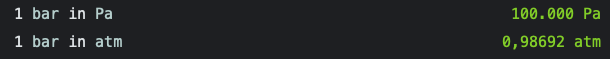

# Pressure Extension for Numi

## What is this extension for? :mag_right:

This extension allows you to easily transform speed from Pascal (Pa) to bar, Newton per squared meter (N/m2), standard atmosphere (atm) and related pressure-units. 

## Installation :floppy_disk:

Simply download the .js file to your numi extensions directory.

## How to use it :wrench:
```
1 bar in Pa = 100.000 Pa 
1 bar in atm = 0,98692 atm
```

## Example :memo:

