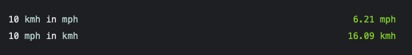

# Speed Extension for Numi

## What is this extension for? :mag_right:

This extension allows you to easily transform speed from kmh to mph and vice versa

## Installation :floppy_disk:

Simply download the .js file to your numi extensions directory.

## How to use it :wrench:
```
10 kmh in mph 
10 mph in kmh 
```

## Example :memo:

