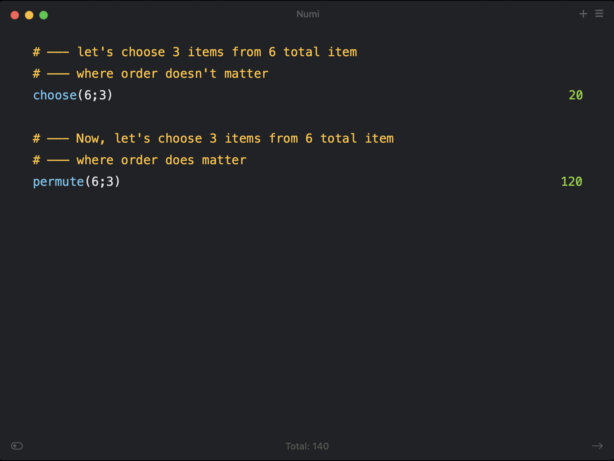

# Basic Combinatorics Extension for Numi :tada

## What is this extension for? :mag_right

This extension allows you to easily calculate the `nPr` and `nCr` of two numbers, `n` and `r`.

## Installation :floppy_disk

Simply download the .js file and copy it to your Numi extensions directory (i.e., `~/Library/Application Support/com.dmitrynikolaev.numi/extensions`).

## How to use it :wrench

To calculate 6 choose 3, for example, you'd write:

- `choose(6;3)`

To calculate 6 permute 3, for example, you'd write:

- `permute(6;3)`

## Example :memo

