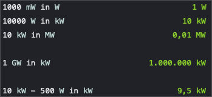

# Electrical Power for Numi

## What is this extension for? :mag_right:

This extension allows you to easily transform electrical power from Watt to Kilowatt, Megawatt, Milliwatt, Gigawatt and vice versa

## Installation :floppy_disk:

Simply download the .js file to your numi extensions directory.

## How to use it :wrench:
```
1000 mW in W
10000 W in kW
10 kW in MW

1 GW in kW

10 kW - 500 W in kW
```

## Example :memo:
