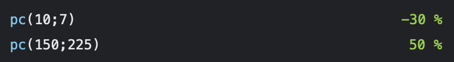

# Percent Change Extension for Numi

## What is this extension for? :mag_right:

This extension will calculate the percent change between two values, returning the value as a formatted percentage.

## Installation :floppy_disk:

Simply download the .js file to your numi extensions directory.

## How to use it :wrench:
```
pc(10;7)
pc(150;225)
```

## Example :memo:

