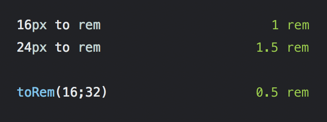

# Screen Units Extension for Numi

## What is this extension for? :mag_right:

This extension allows you to easily convert pixels to rem. By default, the conversion assumes a 16px base, which can be changed in the file directly.

As well, we have a function for easy manipulation of the base value.

## Installation :floppy_disk:

Simply download the .js file to your numi extensions directory.

## How to use it :wrench:

```
32px in rem = 2 rem 
8px in rem = 0.5 rem
```

## Example :memo:

